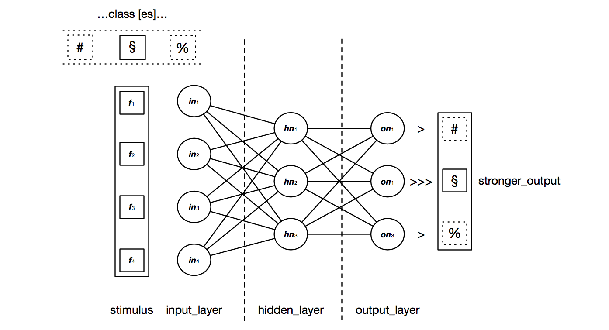
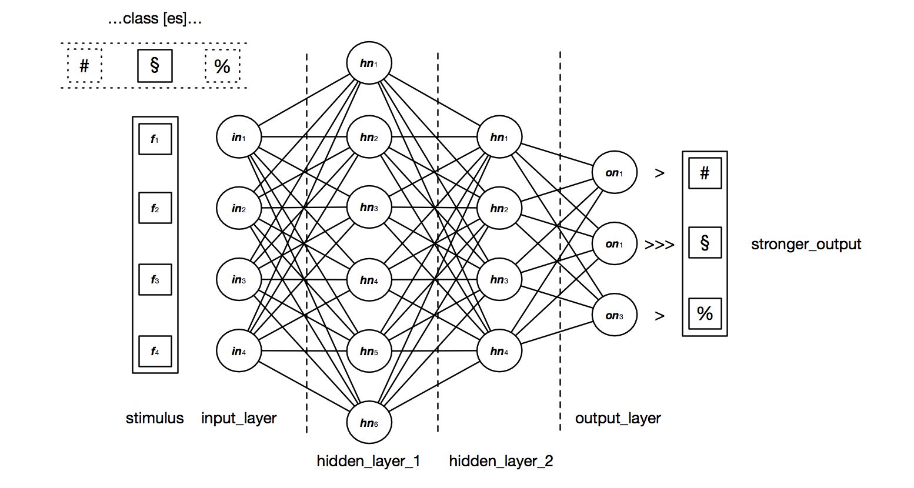

# Go Multilayer Perceptron

A from-scratch implementation, in Go, of three classic neural network models built up in stages:

1. **Single-layer perceptron** - trained with the perceptron learning rule on the [Sonar](https://archive.ics.uci.edu/dataset/151/connectionist+bench+sonar+mines+vs+rocks) dataset (binary classification: rock vs. mine).
2. **Multilayer perceptron (MLP)** - trained with backpropagation on the [Iris](https://archive.ics.uci.edu/dataset/53/iris) dataset (3-class classification), with a configurable number of hidden layers.
3. **Elman recurrent network** - trained to learn binary addition (feed it two random binary numbers, it learns to output their sum).

All three models, plus train/test splitting and k-fold cross-validation, are demoed end to end in `main.go`.

## Project layout

```
main.go                     entry point; runs all three demos
neural/
  neuronUnit.go              a single perceptron unit: weights, bias, predict, train
  neuralLayer.go              a layer of NeuronUnits
  multiLayerNetwork.go       MLP / Elman network: forward pass + backpropagation
  pattern.go                 dataset loading (CSV) and synthetic pattern generation
  transferFunction.go        activation functions (sigmoid, tanh, heaviside) and derivatives
validation/
  validation.go               train/test split, k-fold split, k-fold & random-subsampling validation
util/
  util.go                     small numeric/string helpers (scalar product, binary<->int, etc.)
res/
  sonar.all_data.csv          Sonar dataset (208 rows)
  iris.all_data.csv           Iris dataset (150 rows)
```

## Requirements

- Go 1.21 or newer (developed against `go 1.26`)

## Running the demos

```
go run main.go
```

This runs all three demos in sequence and logs, for each one, per-fold accuracy and a mean score. Each demo can be toggled independently via the `run*Demo` constants at the top of `main()` in `main.go`.

Typical output on this machine:

| Model | Dataset | Mean accuracy |
|---|---|---|
| Single-layer perceptron | Sonar | ~65-72% |
| MLP (`[4, 20, 3]`, backprop) | Iris | ~90-97% |
| Elman RNN | binary addition | ~55-80% (small dataset, high run-to-run variance) |

Numbers vary between runs since datasets are shuffled and weights are randomly initialized.

You can configure a network topology with `PrepareMLPNet`. Its first parameter, a `[]int`, defines the whole layer structure:

- `[4, 3, 3]` defines input, hidden, and output layers with 4, 3, and 3 neurons respectively. The input layer's neuron count must match the number of features in a pattern; the output layer's neuron count must match the number of classes.

  

- `[4, 6, 4, 3]` defines a deeper network with two hidden layers:

  

## Running the tests

```
go test ./...
```

Each package (`util`, `neural`, `validation`) has unit tests covering its public API - including a check that a small MLP can learn XOR (a problem that requires an actual hidden layer to solve, so it also validates that backpropagation and weight initialization aren't accidentally degenerate).

## Notable fixes made to get this working

This project didn't compile out of the box - the import paths pointed at a different module than the one declared in `go.mod`, and the `validation` package referenced from `main.go` didn't exist in the repo at all. Beyond making it compile, a few functional bugs were fixed along the way:

- **Sigmoid derivative was a constant.** `SigmoidalTransferDerivate` returned `1.0` unconditionally instead of `d * (1 - d)`, which silently broke gradient scaling during backpropagation.
- **Weight initialization was near-zero.** Neurons were initialized with a `1e-13` scaling factor, so every neuron in a layer started out virtually identical. Since backprop then nudged them by nearly the same amount, they never differentiated - capping the network below what a single neuron could do and making it unable to learn problems like XOR that require a genuine hidden layer. Replaced with Xavier/Glorot-style scaling (`stddev = 1/sqrt(fan-in)`).
- **`2^d` doesn't mean "2 to the power of d" in Go** - `^` is bitwise XOR. `GenerateRandomIntWithBinaryDim`/`GenerateRandomBinaryInt` were sampling from the wrong range as a result; fixed to `int64(1) << uint(d)`.
- **Train/test leakage in MLP validation.** `MLPKFoldValidation`/`MLPRandomSubsamplingValidation` were training on the *entire* pattern set (including the held-out fold) instead of just the training split.
- **A library function called `log.Fatal` on a bad file path**, which calls `os.Exit` and kills the whole process - even though the function already returns an `error` for the caller to handle. Downgraded to a logged error so the caller can decide what to do (including in tests, which no longer crash the test binary).
- The MLP demo in `main.go` was gated behind `if false` and never actually ran.

## Future ideas

- Better vector/matrix handling (e.g. via [gonum](https://www.gonum.org/))
- Additional activation functions / optimizers (momentum, Adam)
- Persisting trained weights to disk
